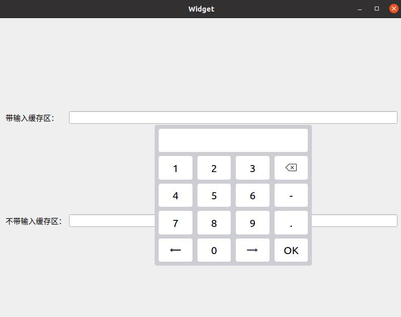
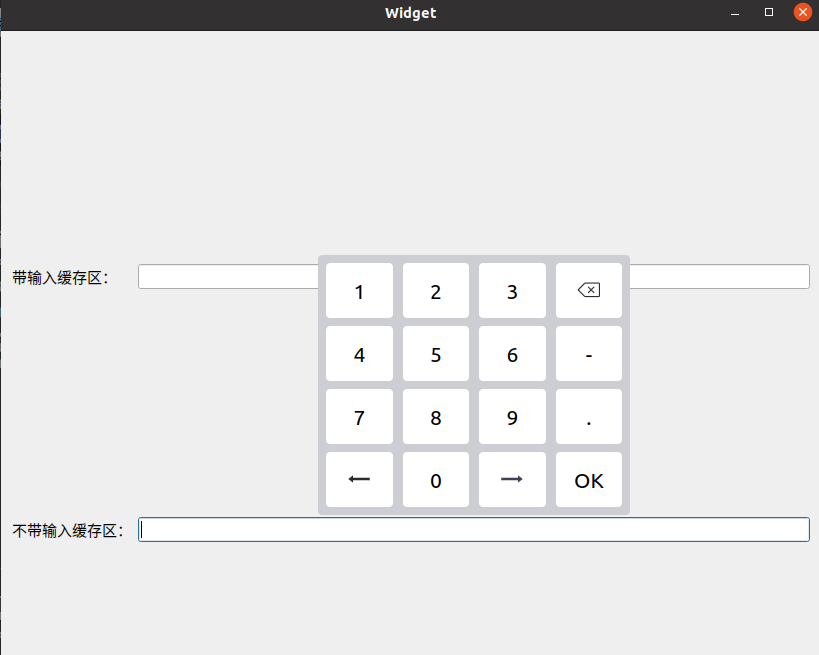

# NumberKeyboard
这是一个使用Qt Widget开发的数字小键盘组件,主要用于嵌入式显示屏端的数字输入。
## 示例


## 功能概述：
* 该组件采用单例模式，利用智能指针实现资源的自动释放。使用Popup窗口标志实现点击窗口外关闭的功能,不可设置父对象。
* 该组件提供直接输入和间接输入两种方式，其中间接输入界面提供一个输出缓存区，通过信号的形式将输入的内容传递出来，而直接输入则是将外部的编辑框指针传到组件内部直接输入。此外还提供了根据输入控件自动计算小键盘合理位置的接口。
```
    //单例模式
    static NumberKeyboard * getInstance();
    //显示输入缓存区
    void showInputBufferArea(QString inputContent=QString(),const QValidator *validator=NULL);
    //隐藏输入缓存区
    void hideInputBufferArea(QLineEdit *currLineEdit,bool autoMovePos = true);
    //计算数字小键盘显示的位置
    QPoint calcNumberKeyboardPos(QWidget *inputWidget);
```
## 作者联系方式:
**邮箱:justdoit_mqr@163.com**  
**新浪微博:@为-何-而来**  
